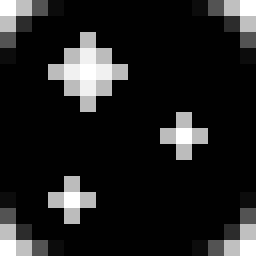

# Starry UI

Starry UI Monorepo

## Installation

See the list of available components at https://www.npmjs.com/org/starryui

## Development

To create a new package i.e. called `button`, run `npm init --scope=@starryui -y -w ./packages/button`

To install one package as a dependency of another package, run `npm i @starryui/<depname> -w @starryui/<destname>`
